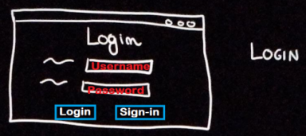
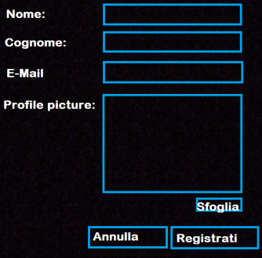
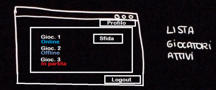
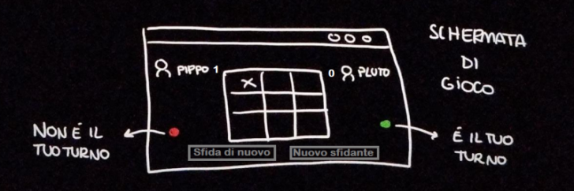
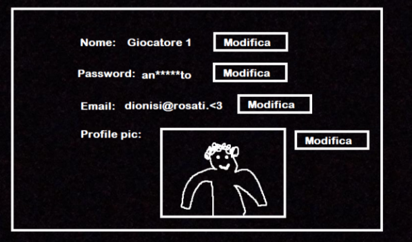

>*Linguaggi e tecnologie per il web (Prof: Riccardo Rosati) 
>D'Amico Martina, Dito Andrea*

<h1>Documentazione progetto</h1>

## Specifiche

Si vuole realizzare un'applicazione che consenta a due o più utenti di giocare al gioco del tic tac toe (tris). Di ogni utente è necessario conoscere l'username, la sua password ed eventualmente un'immagine.

L'utente una volta registrato può giocare una partita selezionando uno degli utenti online, i quali possono essere: *online*, *offline* oppure *in partita*, solo ai giocatori online è possibile inviare una proposta di sfida.

Di ogni partita interessa sapere se la partite è in corso, iniziata o terminata, chi gioca con X e chi con O, in particolare l'applicazione sceglierà randomicamente il simbolo.
Il giocatore a cui è stato assegnato X fa la prima mossa.

Nella schermata di gioco viene registrato il punteggio dei due giocatori.

Se la partita è:
 * **in corso** interessa sapere a chi tocca la mossa successiva e registrare le mosse con il relativo ordine.
 * **terminata** interessa sapere il risultato della partita (1: vince X, 2: vince O, 3: patta).

Del giocatore interessa sapere il numero di partite: *perse*, *vinte* e *pareggiate*

Una volta terminata la partita l'utente può:

 * scegliere se giocare una nuova partita con l'avversario appena sfidato, il quale potrà accettare o meno.
 * tornare nella schemata precedente e scegliere un nuovo avversario
 * fare logout e uscire dall'applicazione

## Specifiche dei dati
...

## Specifiche delle funzioni
...

## Lato client (Front-end)
### 1-Schermata di login
Vi si accede non appena si entra nell'applicazione o cliccando il pulsante di logout dalla schermata di scelta dello sfidante.
Ha due campi compilabili (*username* e *password*) e due bottoni da poter cliccare (*login* e *signin*). Cliccando su *login* si accede alla schermata di scelta dello sfidante. Cliccando su *signin* si accede alla schermata di registrazione.

### 2-Schermata di registrazione
Vi si accede cliccando su sign-in nella schermata di login
Ha 4 campi compilabili (Nome, Cognome, Email e Profile picture).
Ha 3 bottoni cliccabili (Sfoglia, Annulla e registrati). Sfoglia permette di cercare fra i file del proprio pc l’immagine di profilo. Annulla riporta alla schermata di login. Registrati porta alla schermata di scelta dello sfidante.

### 3-Schermata di scelta dello sfidante
Vi si accede cliccando login dalla schermata di login, oppure registrati dalla schermata di registrazione, oppure nuovo sfidante dalla schermata di gioco.
Ha 3 pulsanti cliccabili, quello di profilo, che porta alla schermata di profilo e quello di logout, che porta alla schermata di login. L’ultimo pulsante è quello di sfida, situato accanto ad ogni giocatore online, e porta alla schermata di gioco (una volta cliccato fará comparire un popup con scritto “Giocatore x ti ha proposto una sfida!”, con pulsanti accetta e rifiuta nella schermata dell’avversario. Fará invece comparire “Sfida proposta” al posto del pulsante sfida nella schermata del giocatore).

Il resto della schermata è volto a indicare ogni giocatore online. Di ogni giocatore viene fatto vedere l’username e lo status (Online, In partita e offline) (preferibilmente seguendo quest’ordine, di modo da avere tutti i giocatori sfidabili ad inizio pagina).

### 4-Schermata di gioco
Vi si accede cliccando il pulsante sfida da Schermata di scelta dello sfidante.
A partita terminata compare un popup che dice “Hai vinto!”.

Dopo la partita si “abilitano” i pulsanti sfida di nuovo e nuovo sfidante. Cliccando su nuovo sfidante si torna alla schermata di scelta dello sfidante. Cliccando sfida di nuovo l’avversario riceve un popup: “L’avversario ti ha sfidato!” “Accetta” “Rifiuta”.

### 5-Schermata di profilo
Vi si accede cliccando profilo dalla schermata di scelta dello sfidante.
Mostra le informazioni sull’utente, permettendone la modifica mediante l’apposito pulsante.
Quando si vuole clicca il pulsante modifica compare un popup con i 3 campi compilabili (ad esempio) “Vecchia password” “Nuova password” “Conferma nuova password”

## Lato server (back-end)
Tutte le informazioni trasmesse e restituite dal server vengono trasmesse in formato json.

## Dizionario degli oggetti
### Classe utente
|proprietà|tipo|descrizione|
|-----|-------|------|
|stato| intero  |1: online 0: offline 2: in paritita|
|username| stringa | nome scelto dall'utente|
|password| stringa ||

## REST server endpoints

## Utenti

|Url|metodo|descrizione|
|---|------|-----------|
|`utenti/all`|`get`|restituisce un vettore degli utenti on line|
|`utenti/{id}`|`get`|restituisce informazioni sull'utente|
|`utenti`|`post`|aggiunge un nuovo utente e restituisce l'oggetto json dell'utente Parametri richiesti: username e password|
|`utenti`|`put`|modifica attributi dell'utente e restituisce l'oggetto json dell'utente Attributi modificabili: password|
|`utenti/immagine`|`put`|modifica immagine per l'utente|
|`utenti/login`|`put`|effettua il Login e passa nello stato online e restituisce l'oggetto json dell'utente  Parametri richiesti: username e password|
|`utenti/logout`|`put`|effettua il Logout e passa nello stato offline  Parametri richiesti: username e password|
|`utenti`|`delete`|rimuove utente Parametri richiesti: username e password|

## Partita (PROVVISORIO)
|Url|metodo|descrizione|
|---|------|-----------|
|`partita`|`get`|restituisce un vettore delle partite in corso|
|`partita/{id}`|`get`|restituisce dettagli sulla partita id|
|`partita/{id}/mossa`|`get`|restituisce una stringa di 9 caratteri che identifica le mosse effettuate nella partita id|
|`partita/{id}/punteggio`|`get`|restituisce il punteggio della partita id|
|`partita`|`post`|crea una nuova partita|
|`partita/{id}/mossa`|`put`|modifica stringa di 9 caratteri con mossa appena effettuata|
|`partita/{id}`|`delete`|rimuove partita id|

